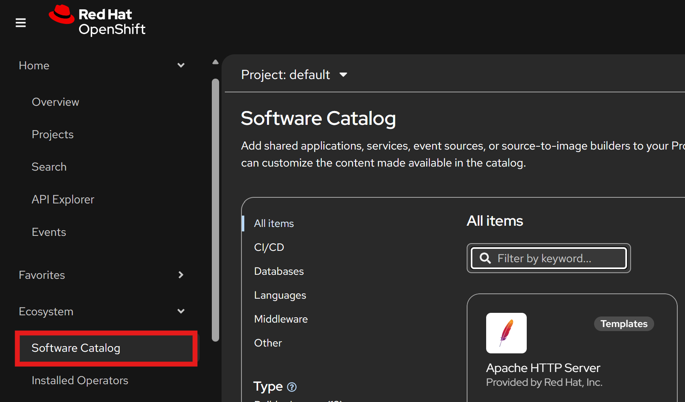
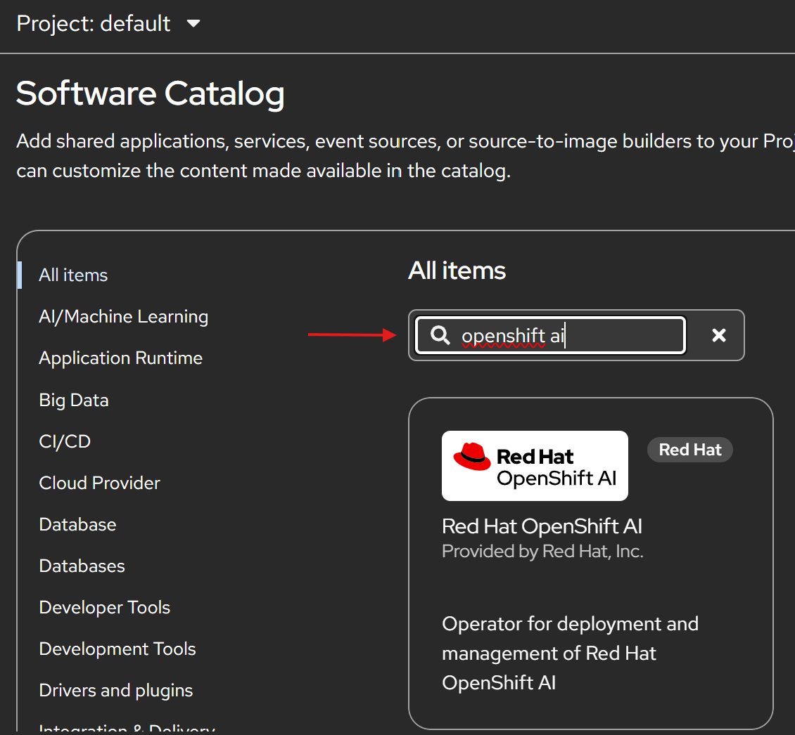
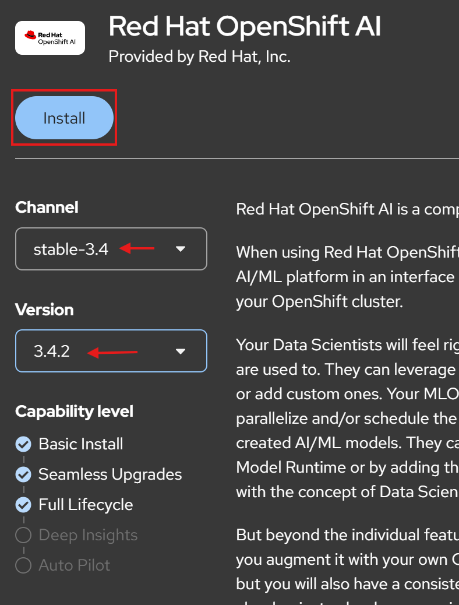
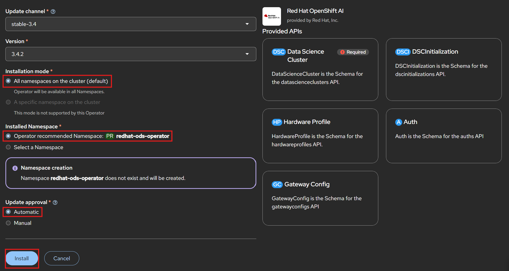
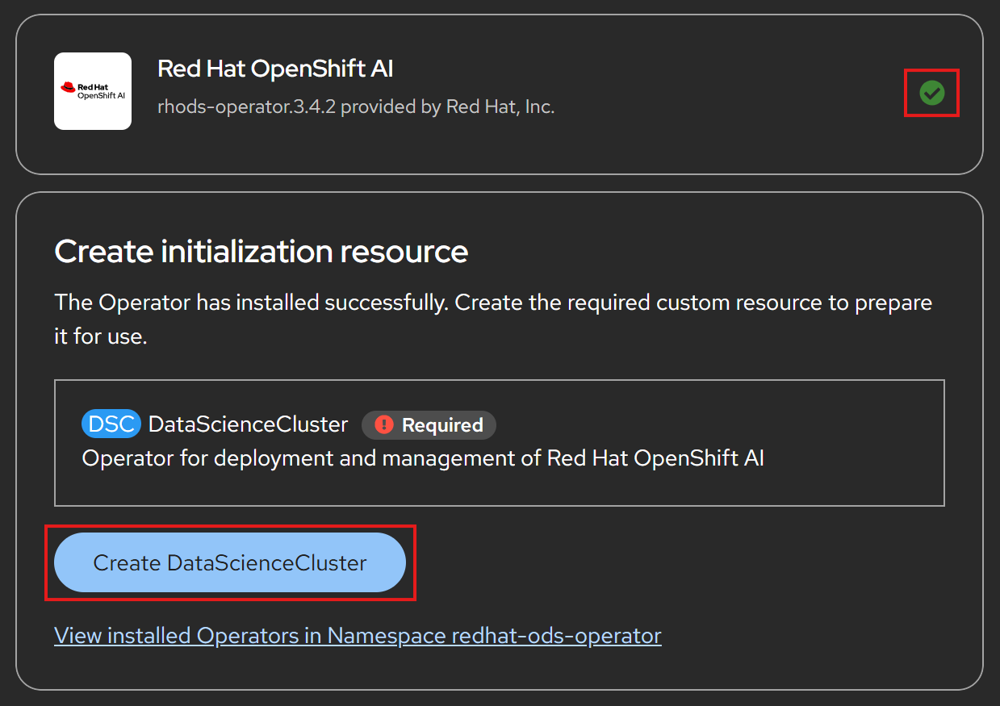
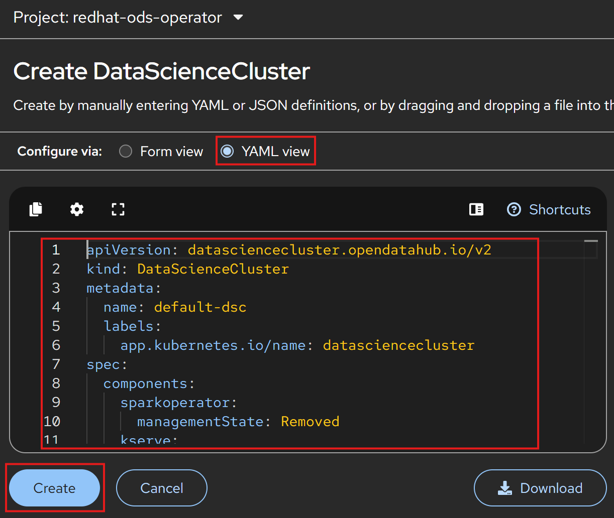
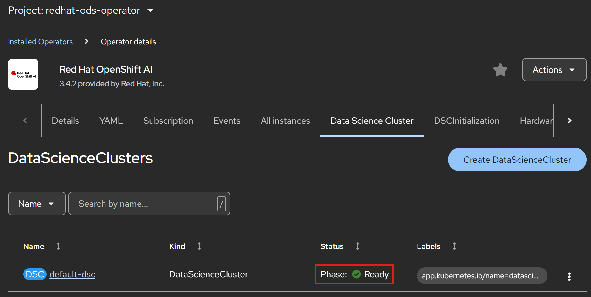
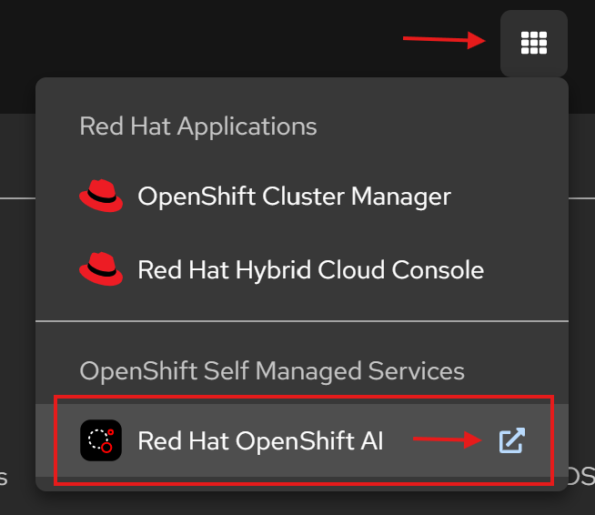
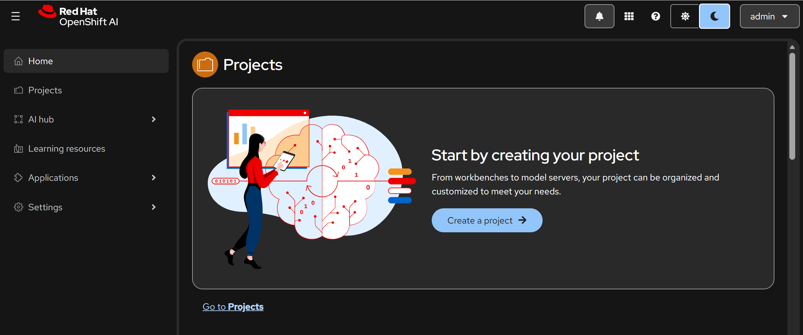

# Red Hat OpenShift AI 3.4 — Minimal Installation Guide

**Target:** OpenShift Container Platform 4.20 (Web Console install)

**Scope:** Dashboard + Workbenches only. No model serving (KServe), no pipelines, no distributed workloads. No additional operator dependencies required.

**Time required:** ~20–30 minutes

**Last verified:** 2026-07-14 against the official RHOAI 3.4 documentation

---

## 1. Prerequisites

Verify **all** items before starting.

| # | Requirement | How to verify |
|---|-------------|---------------|
| 1 | OCP 4.19–4.20 | `oc version` |
| 2 | Cluster-admin user via identity provider (**not** `kubeadmin`) | `oc whoami` |
| 3 | ≥ 2 worker nodes, each ≥ 8 CPUs / 32 GiB RAM | `oc get nodes -o wide` |
| 4 | Default storage class with dynamic provisioning | `oc get storageclass` → one entry marked `(default)` |
| 5 | Registry access: `cdn.redhat.com`, `registry.redhat.io`, `quay.io`, `registry.access.redhat.com`, `subscription.rhn.redhat.com` | check proxy/firewall |
| 6 | RHOAI Self-Managed subscription attached to the cluster | Red Hat Console |
| 7 | Open Data Hub is **not** installed | `oc get ns \| grep opendatahub` → no result |

> **Why no other operators?** In RHOAI 3.x, cert-manager, Kueue, etc. are only
> required by specific components (KServe, distributed workloads). Since this
> minimal install enables only `dashboard` and `workbenches`, the RHOAI Operator
> itself is the only thing you install.

> **Storage note:** Every workbench creates a PersistentVolumeClaim for the
> user's home directory. Without a working default storage class, workbenches
> will hang in `Pending`.

---

## 2. Install the Red Hat OpenShift AI Operator

> **OCP 4.20 navigation change:** OperatorHub and the Developer Catalog were
> merged into a unified **Software Catalog** under the new **Ecosystem** menu.

1. Log in to the OpenShift web console as a cluster administrator.

2. Navigate to **Ecosystem → Software Catalog**.

   

3. Under **Type**, filter for **Operators**, then type
   `Red Hat OpenShift AI` into the keyword filter.

   

4. Click the **Red Hat OpenShift AI** tile. An information side panel opens.

5. Select:
   - **Channel:** `stable` (production) — alternatives: `stable-3.4` to stay
     pinned to this minor version, `fast` for the newest features.
   - **Version:** the latest `3.4.x`.

   Click **Install**.

   

6. On the **Install Operator** page, configure:

   | Field | Value | Explanation |
   |-------|-------|-------------|
   | Installation mode | *All namespaces on the cluster* | only available option |
   | Installed Namespace | **Operator recommended: `redhat-ods-operator`** | predefined operator namespace |
   | Update approval | **Manual** (recommended for prod) | RHOAI upgrades sequentially through every intermediate version; with *Automatic*, OLM immediately walks to the latest release |

   

7. Click **Install** and wait until the checkmark appears
   ("Installed operator: ready for use").

   

**Verification (Optional):**

Navigate to **Ecosystem → Installed Operators** (project: `redhat-ods-operator`)
and confirm status **Succeeded**. This can take a few minutes.

Or via CLI:

```bash
oc get csv -n redhat-ods-operator
# NAME                    DISPLAY                  PHASE
# rhods-operator.3.4.x    Red Hat OpenShift AI     Succeeded
```

---

## 3. Create the DataScienceCluster (minimal)

The Operator alone installs no user-facing components. Components are enabled
through a `DataScienceCluster` custom resource. `Managed` = install and keep
active; `Removed` = do not install (remove if present).

1. Click on `Create DataScienceCluster`  or navigate to **Ecosystem → Installed Operators → Red Hat OpenShift AI**.

2. Open the **DataScienceCluster** tab and click **Create DataScienceCluster**.

   

3. Switch to **YAML view** and paste:

   

```yaml
  apiVersion: datasciencecluster.opendatahub.io/v2
  kind: DataScienceCluster
  metadata:
    name: default-dsc
    labels:
      app.kubernetes.io/name: datasciencecluster
  spec:
    components:
      dashboard:
        managementState: Managed
      workbenches:
        workbenchNamespace: rhods-notebooks   # cannot be changed after installation
        managementState: Managed
      kserve:
        managementState: Removed              # enable later; requires cert-manager Operator
        modelsAsService:
          managementState: Removed
        nim:
          airGapped: false
          managementState: Removed
        rawDeploymentServiceConfig: Headless
        wva:
          managementState: Removed
      aipipelines:
        managementState: Removed
        argoWorkflowsControllers:
          managementState: Removed
      modelregistry:
        registriesNamespace: rhoai-model-registries
        managementState: Removed
      llamastackoperator:
        managementState: Removed
      feastoperator:
        managementState: Removed
      trustyai:
        managementState: Removed
        eval:
          lmeval:
            permitCodeExecution: deny
            permitOnline: deny
        mcpGuardrailsMode: false
      kueue:
        defaultClusterQueueName: default
        defaultLocalQueueName: default
        managementState: Removed
      ray:
        managementState: Removed
      trainer:
        managementState: Removed
      trainingoperator:
        managementState: Removed
      sparkoperator:
        managementState: Removed
      mlflowoperator:
        managementState: Removed
```

   **Notes:**
   - `apiVersion: .../v2` is the 3.x schema (2.x used `v1`).
   - `workbenchNamespace` only affects *standalone/basic* workbenches
     (the Jupyter tile). Project workbenches always run in their own
     data science project namespace. **This value cannot be changed after
     installation.**
   - Fields under `Removed` components (e.g. `registriesNamespace`) are
     inert but kept for schema completeness.

4. Click **Create**.

**Verification:**

```bash
# DSC should reach phase "Ready" (1–3 minutes):
oc get datasciencecluster default-dsc

# Expected pods in the applications namespace:
oc get pods -n redhat-ods-applications
# rhods-dashboard-...          Running
# notebook-controller-...      Running
# odh-notebook-controller-...  Running
```



---

## 4. Access the Dashboard

**Option A — Application launcher (easiest):**

In the OpenShift web console, click the application launcher icon
(⋮⋮⋮ grid symbol, top right corner) and select **Red Hat OpenShift AI**.



> The entry appears automatically once the dashboard component is deployed.
> If it's missing, the dashboard pod is not ready yet — see Section 7.

**Option B — Route via CLI:**

```bash
oc get route rhods-dashboard -n redhat-ods-applications \
  -o jsonpath='{.spec.host}{"\n"}'
```

Open the URL in a browser and log in with your OpenShift identity provider
credentials.



---

## 5. Grant user access

By default only cluster admins have full access. Add your users/groups:

1. In the RHOAI dashboard: **Settings → User management**.
2. Add OpenShift groups or users as **Data science users** and
   **Data science administrators**.


Alternatively via OpenShift groups on the CLI:

```bash
oc adm groups new rhods-users
oc adm groups add-users rhods-users alice bob
```

<!-- ---

## 6. Smoke test: first project + workbench

1. Dashboard → **Data science projects → Create project** → name it
   (e.g. `smoke-test`).

   

2. In the project, on the **Workbenches** tile, click **Create workbench**:
   - **Image:** e.g. *Jupyter | Minimal | Python 3.12*
   - **Deployment size:** Small
   - **Cluster storage:** keep default (creates a PVC)

   

3. Wait until status changes from *Starting* to **Running**, then click
   **Open** and log in.

   

**What happened behind the scenes:** a `Notebook` CR and its pod were created
**in the `smoke-test` namespace** — not in `rhods-notebooks`:

```bash
oc get notebooks,pods,pvc -n smoke-test
``` -->

---

## 6. Troubleshooting quick reference

| Symptom | Likely cause | Fix |
|---|---|---|
| Operator stuck in *Installing* | catalog/registry unreachable | check access to `registry.redhat.io`; `oc get catalogsource -n openshift-marketplace` |
| DSC not `Ready` | component error | `oc describe datasciencecluster default-dsc` → Conditions |
| Workbench PVC `Pending` | no default storage class | `oc get storageclass`, set a default |
| Dashboard route 503 | dashboard pod not ready | `oc get pods -n redhat-ods-applications` |
| Login works but dashboard empty/forbidden | user not in RHOAI user group | Section 5 |

---

## 7. Enabling components later (outlook)

Components can be flipped to `Managed` at any time — no reinstall needed.
Example for model serving (requires **cert-manager Operator** first):

```bash
oc patch datasciencecluster default-dsc --type merge \
  -p '{"spec":{"components":{"kserve":{"managementState":"Managed"}}}}'
```

| Component | Prerequisite operators |
|---|---|
| `kserve` | cert-manager |
| llm-d (advanced kserve) | cert-manager, Connectivity Link, Leader Worker Set |
| `kueue`, `ray`, `trainingoperator` | Red Hat build of Kueue, cert-manager |
| GPU workbenches | Node Feature Discovery + NVIDIA GPU Operator (no DSC change needed) |

---

**References**
- [Installing and uninstalling OpenShift AI Self-Managed 3.4](https://docs.redhat.com/en/documentation/red_hat_openshift_ai_self-managed/3.4/html/installing_and_uninstalling_openshift_ai_self-managed/installing-and-deploying-openshift-ai_install)
- [Supported Configurations for RHOAI 3.x](https://access.redhat.com/articles/rhoai-supported-configs-3.x)
