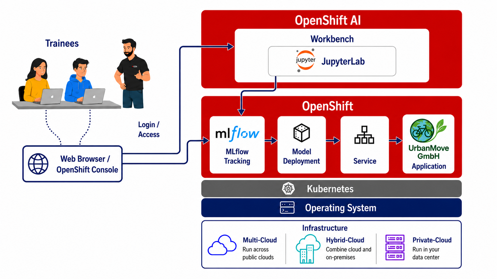

# Bike-Sharing Demand Forecasting

<figure markdown>
  { width="200" }
  { width="200" }
</figure>

## Introduction

In urban environments, bike-sharing systems have emerged as a sustainable and efficient mode of transportation. Accurately predicting bike rental demand is crucial for optimizing operations, ensuring bike availability, and enhancing user satisfaction.

This beginner-level workshop guides you through the full MLOps lifecycle — from data exploration and model training to containerization, deployment on OpenShift, and production monitoring.

## Overview of the Exercises

The workshop follows a complete MLOps workflow:

| Exercise | Topic | Key Skills |
|----------|-------|------------|
| 00 | Environment & Prerequisites | Set up OpenShift AI, clone the repository |
| 01 | Load, Extract, and Clean the Data | Data loading, cleaning, EDA |
| 02 | Prepare the Data for Training | Feature engineering, train/test split |
| 03 | Model Training & Experiment Tracking | Train Random Forest, track with MLflow |
| 04 | Review Experiments & Select the Best Model | Compare runs, select optimal model |
| 05 | Containerize the Model Endpoint-API | FastAPI, Docker containerization |
| 06 | Deploy on OpenShift Cluster | Kubernetes deployment, service exposure |
| 07 | Test Model Endpoint-API | API testing, prediction validation |
| 08 | Model & Data Monitoring | Evidently drift detection, reports |

## Directory Structure

```
bike_forecasting/
├── notebooks/
│   ├── 01_data_exploration.ipynb
│   ├── 02_data_preparation.ipynb
│   ├── 03_model_training.ipynb
│   ├── 04_model_registration.ipynb
│   ├── 05_model_testing_endpoint.ipynb
│   └── 06_model_monitoring.ipynb
├── data/
│   ├── raw/
│   ├── processed/
│   └── test_model/
├── models/
└── reports/
```

## Prerequisites

- Access to an OpenShift AI JupyterLab environment
- Basic Python and machine learning knowledge

## Technologies Used

| Technology | Purpose |
|-----------|---------|
| [scikit-learn](https://scikit-learn.org/) | Random Forest Regressor model |
| [MLflow](https://mlflow.org/) | Experiment tracking and model registry |
| [FastAPI](https://fastapi.tiangolo.com/) | REST API for model serving |
| [Docker](https://www.docker.com/) / OpenShift | Containerization and orchestration |
| [Evidently AI](https://www.evidentlyai.com/) | Model monitoring and drift detection |

## Lab Environment Diagram

The diagram below illustrates the environment and components used throughout this lab.

<figure markdown>
  
</figure>

## Hands-On Sessions

Start with the environment setup, then proceed through the exercises in order:

- [Exercise 0 - Environment & Prerequisites](bike-forecasting/00_environment_prerequisites.md)
- [Exercise 1 - Load, Extract, and Clean the Data](bike-forecasting/01_load_extract_clean_data.md)
- [Exercise 2 - Prepare the Data for Training](bike-forecasting/02_prepare_data_training.md)
- [Exercise 3 - Model Training & Experiment Tracking](bike-forecasting/03_model_training_experiment_tracking.md)
- [Exercise 4 - Review Experiments & Select the Best Model](bike-forecasting/04_review_experiment_best_model.md)
- [Exercise 5 - Containerize the Model Endpoint-API](bike-forecasting/05_containerize_model_endpoint.md)
- [Exercise 6 - Deploy on OpenShift Cluster](bike-forecasting/06_model_deployment_openshift.md)
- [Exercise 7 - Test Model Endpoint-API](bike-forecasting/07_test_model_endpoint.md)
- [Exercise 8 - Model & Data Monitoring](bike-forecasting/08_model_data_monitoring.md)
