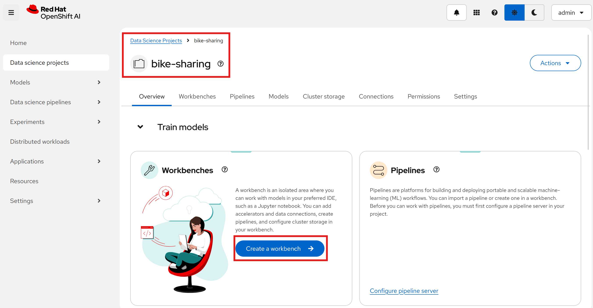
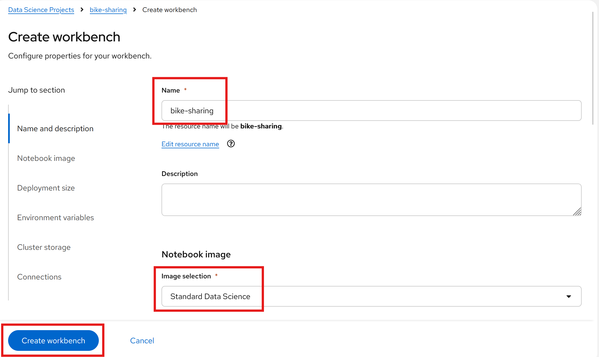
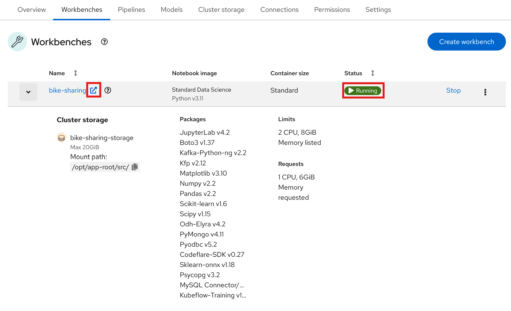
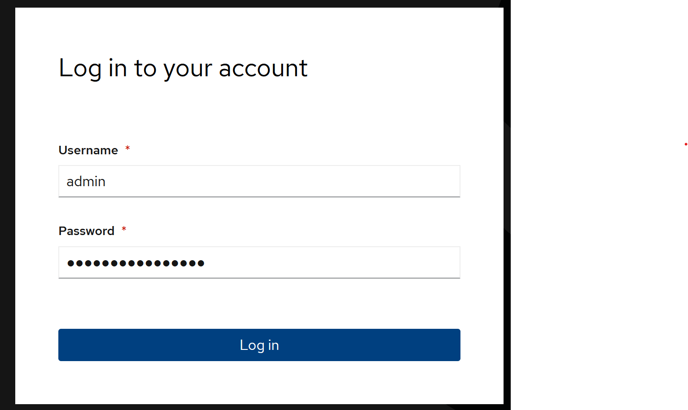
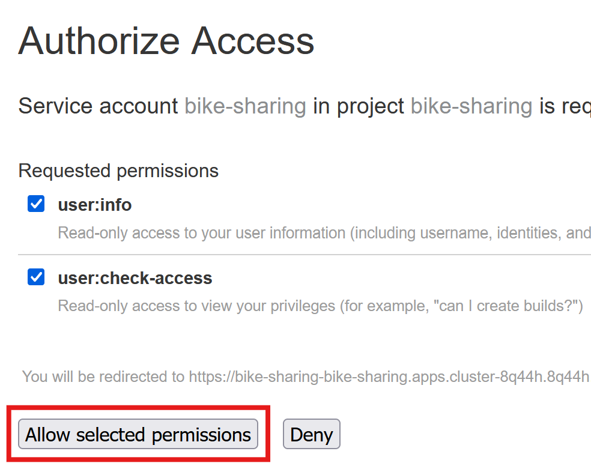
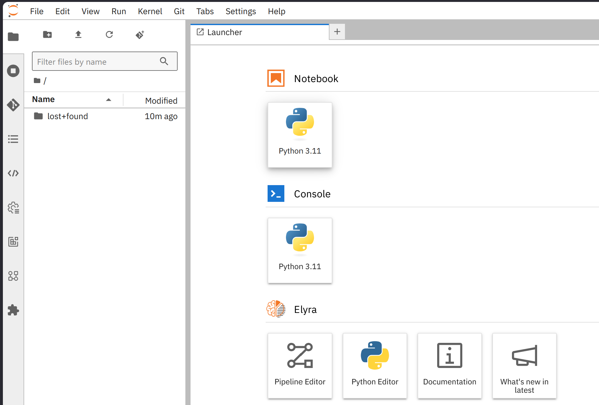
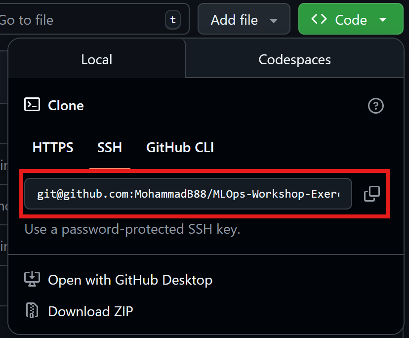

# Exercise 0: Environment and Prerequisites

## Objective
In this lab, we will:

* make ourselves familiar with the environment (Openshift & OpenShiftAI)
* clone the repository containing the workshop materials

## Prerequisites

- Access to an OpenShift environment with OpenShift-AI and JupyterLab activated

## Step 1: Access the Environment
You will be provided a link and necessary credentials to access an OpenShift instance.

Follow these steps to set up your environment:

1. **Create a Project**: Start by creating a new project in the OpenShift console to isolate your workshop resources.
""

2. **Create a Workbench**: Navigate to the OpenShift AI (RHODS) dashboard and create a new workbench instance.
""

3. **Open the Workbench**: Once the workbench is provisioned, click the "Open" button to launch the JupyterLab environment.
""

4. **Login to Workbench**: If prompted, enter your credentials to authenticate and access the workbench.
""

5. **Access the Dashboard**: You are now inside the workbench environment.
""

6. **Verify the Interface**: Familiarize yourself with the JupyterLab interface where you will be performing the exercises.
""

## Step 2: Clone the Repository
Clone the repository containing lab materials from GitHub.

#### Copy the Repo-URL

Go to the original GitHub repository page: "[Clone Repo Github](https://github.com/MohammadB88/MLOps-Workshop-Exercises)" and copy the the URL of the repo:


#### Open the created workbench
At the left panel, you can click on git-icon shown in the below image and select `Clone a Repository`.


<!-- 
Copy the URL of the original repo  repository:

 -->

paste the copied URL from original repo and click on ``clone`` to download the code inside the jupyterlab:


Go to the path `MLOps-Workshop-Exercises/labs/01_beginner/`, where you find the workshop materials for `bike demand forecasting`.

<!-- ### Option B: SSH URL
In case you are going to clone the repo from a terminal, use below instructions:

#### Generate an SSH key
Run the following command in your terminal:

```bash
ssh-keygen -t ed25519 -C "your_email@example.com"
```

#### Copy your public SSH key
Copy the entire output (starts with ssh-ed25519) of this command.
```bash
cat ~/.ssh/id_ed25519.pub (i.g. cat /opt/app-root/src/.ssh/id_rsa.pub)
```

#### Add the SSH Key to your GitHub Account
- Go to GitHub > Settings > SSH and GPG keys.
- Click "New SSH key".
- Paste your copied key and give it a descriptive title.

#### Clone the repo using SSH-URL and stored SSH-Key
Copy the URL of the repository


and use `git` to download the code:
```bash
git clone git@github.com:your-username/your-forked-repo.git
``` -->

## Summary

In this exercise, you:

1. Access and get familiar with the workshop environment
2. Cloned the workshop repository using HTTPS 
3. Verified the repository structure and workshop materials

---

