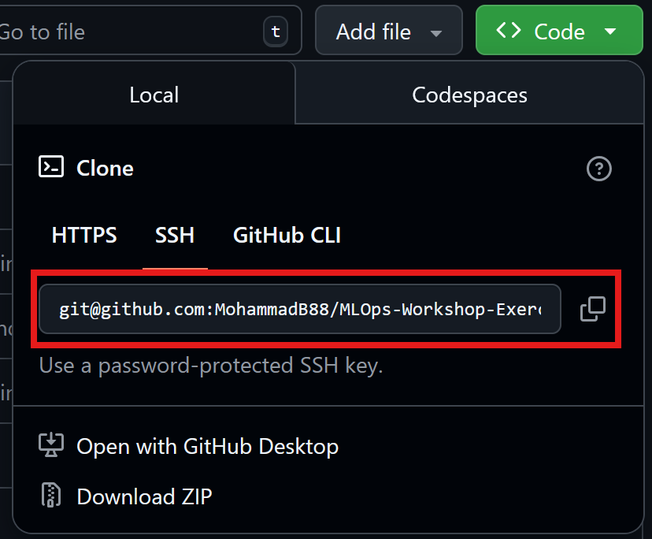

# 1: Environment and Prerequisites

## Objective
In this lab, we will:

* make ourselves familiar with the environment
* clone the repository containing the workshop materials

## Guide

### Step 1 - Access the Environment
You will be provided a link and necessary credentials to an OpenShift AI instance with a ready workbench including *JupyterLab*. 

### Step 2a - Clone the Repository - HTTPs-URL

Go to the original GitHub repository page and copy the the URL of the repo:


#### Open the created workbench
At the left panel, you can click on git-icon shown in the below image and select `Clone a Repository`.


<!-- 
Copy the URL of the original repo  repository:

 -->

paste the copied URL from original repo and click on ``clone`` to download the code inside the jupyterlab:


Go to the path `MLOps-Workshop-Exercises/workshop_materials/`, where you find the workshop materials.


### Step 2b - Clone the Repository - SSH-URL
In case you are going to clone the repo from a terminal, use below instructions:

#### Generate an SSH key
Run the following command in your terminal:

```bash
ssh-keygen -t ed25519 -C "your_email@example.com"
```

#### Copy your public SSH key
Copy the entire output (starts with ssh-ed25519) of this command.
```bash
cat ~/.ssh/id_ed25519.pub (i.g. cat /opt/app-root/src/.ssh/id_rsa.pub)
```

#### Add the SSH Key to your GitHub Account
- Go to GitHub > Settings > SSH and GPG keys.
- Click "New SSH key".
- Paste your copied key and give it a descriptive title.

#### Clone the repo using SSH-URL and stored SSH-Key
Copy the URL of the repository


and use `git` to download the code:
```bash
git clone git@github.com:your-username/your-forked-repo.git
```

✅ **At this point, we are ready to go to the next exercise** [Load, Extract, and Clean the Data](./02_load_extract_clean_data.md).


