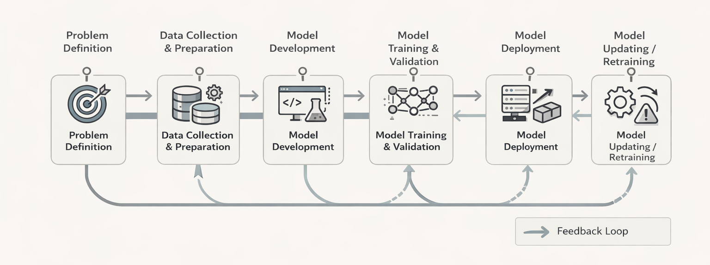

# MLOps Overview - TODO

What is MLOps and why and which tools and workflows.

<figure markdown>
  { loading=lazy }
  <figcaption></figcaption>
</figure>

<!-- TODO - Should I create a dir and pack all the reading materials in that dir. Does it make sense? -->

* [Introduction](theory/introduction.md)
<!-- * [tbd](theory/???.md) -->
