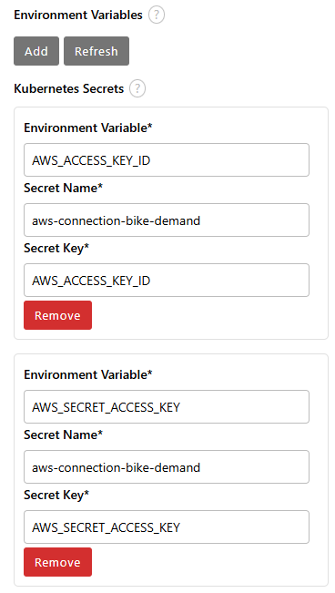
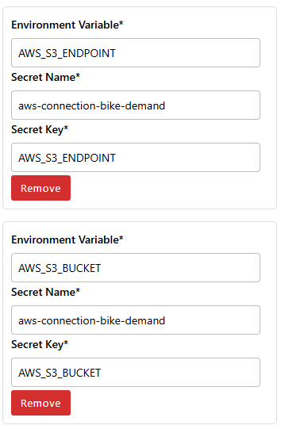

# Bike Demand Forecasting

## 🚲 Introduction: Forecasting Bike-Sharing Demand and Monitoring Model Performance

In urban environments, bike-sharing systems have emerged as a sustainable and efficient mode of transportation. Accurately predicting bike rental demand is crucial for optimizing operations, ensuring bike availability, and enhancing user satisfaction.

This documentation presents a comprehensive approach to developing and deploying a machine learning model for bike-sharing demand prediction. Drawing inspiration from [Analytics Vidhya's end-to-end case study](https://www.analyticsvidhya.com/blog/2023/05/end-to-end-case-study-bike-sharing-demand-prediction/), we delve into data preprocessing, feature engineering, model training, and evaluation. 
Analytics Vidhya

Beyond model development, maintaining performance in a production environment is vital. Models can degrade over time due to changing data patterns, a phenomenon known as concept drift. To address this, we incorporate monitoring strategies inspired by [Evidently AI's tutorial on production model analytics](https://www.evidentlyai.com/blog/tutorial-1-model-analytics-in-production). This includes setting up regular performance checks and generating interactive reports to detect issues proactively.

By following this guide, you'll gain insights into building a robust machine learning pipeline for bike-sharing demand prediction and implementing effective monitoring to ensure sustained model performance in real-world applications.

## Directory Structure

The bike_demand_forecasting project is organized into modular folders for clarity and workflow. It includes raw and processed datasets under data/, Jupyter notebooks for each MLOps stage in notebooks/, trained models in models/, and generated analysis or drift reports in reports/—supporting a full ML lifecycle.

```
bike_demand_forecasting/
├── data/
│   ├── raw/
│   ├── processed/
├── notebooks/
│   ├── 01_data_exploration.ipynb
│   ├── 02_data_exploration.ipynb
│   ├── 03_model_deployment.ipynb
│   └── 04_drift_reports.ipynb
├── models/
└── reports/
```

## Prerequisites

## Steps

## 📘 Hands-On Walkthrough: Step-by-Step Notebook Execution

To build a strong foundation in MLOps, participants will begin by executing each stage of the machine learning workflow manually. This hands-on approach helps solidify the concepts and understand how data and models progress through the pipeline.

### 🔧 Instructions:
1. Use the provided JupyterLab environment, which comes pre-configured and ready to use. No additional setup is required.

2. Clone the workshop repository into your environment using the following command in a terminal:
```
git clone https://github.com/<your-org-or-username>/bike_demand_forecasting.git
cd bike_demand_forecasting
```

3. Open and execute the notebooks sequentially from the notebooks/ directory:
    - `01_data_exploration.ipynb` – Explore, clean, and preprocess the dataset.
    - `02_model_training.ipynb` – Train the machine learning model and track experiments with MLflow.
    - `03_model_deployment.ipynb` – Package the trained model, expose it via a REST API, and deploy it in a containerized environment.
    - `04_drift_reports.ipynb` – Monitor data and model drift using Evidently.

4. Follow the markdown instructions and run each code cell to observe the behavior and flow of data through the pipeline.

5. Take note of the inputs and outputs of each notebook, as these will be important for connecting stages when we later build the full MLOps pipeline.

This guided manual execution lays the groundwork for understanding the lifecycle of ML systems before integrating more advanced practices.

## 🔄 Automating the Workflow with Elyra Pipelines
After completing the manual execution of each notebook, the next step is to automate the workflow using Elyra's pipeline capabilities. Elyra allows you to visually compose, configure, and execute pipelines directly within JupyterLab, streamlining the machine learning lifecycle.

### 🛠️ Instructions:

#### 1. **Open Elyra Pipeline Editor:**
  - In JupyterLab, click on the Launcher tab.
  - Under the Elyra section, select Pipeline Editor to create a new pipeline.

#### 2. **Configure the Pipeline Environment:**
Before adding notebooks, ensure your Elyra environment is properly configured:

  - Connect to S3 Storage: Ensure you have access to an S3-compatible object store (e.g., AWS S3, MinIO).
  - Define Kubernetes Secrets: Use an existing Kubernetes secret that includes the following keys:
     - `AWS_ACCESS_KEY_ID`
     - `AWS_SECRET_ACCESS_KEY`
     - `AWS_S3_BUCKET`
     - `AWS_S3_ENDPOINT`
  
  - These secrets should be referenced in your runtime configuration to allow pipeline nodes to read/write from S3, as shown in these images:
  
    
    

  - Set a Default Runtime Configuration:
     - Go to Elyra’s Pipeline Settings.
     - Select or create a Runtime Configuration pointing to your Kubernetes-based execution environment (e.g., Kubeflow Pipelines, Apache Airflow, or local).
     - Assign this configuration as default to streamline pipeline runs.

#### 3. **Add Notebooks to the Pipeline:**
  - From the file browser, drag and drop the following notebooks onto the pipeline canvas:
     - `01_data_exploration.ipynb`
     - `02_model_training.ipynb`
     - `03_model_deployment.ipynb`
     - `04_drift_reports.ipynb`

#### 4. **Define Execution Order:**
    - Connect the notebooks in the order listed above by drawing lines between them, establishing the execution sequence.

#### 5. **Configure Node Properties:**
  - For each notebook node, specify the following:
    - Runtime Image: Select an appropriate Docker image that contains the necessary dependencies.
    - File Dependencies: List any files required by the notebook.
    - Output Files: Specify the files generated by the notebook that will be used in subsequent steps.
    - Environment Variables: Set any environment variables needed for execution.

#### 6. **Save the Pipeline:**
  - Click on File > Save Pipeline and name your pipeline, for example, `bike_demand_forecasting.pipeline`.

#### 7. **Run the Pipeline:**
   - Click on the Run Pipeline button (▶️) in the pipeline editor toolbar.
   - In the run configuration dialog:
    - Pipeline Name: Enter a name for this run instance.
    - Runtime Configuration: Choose the configuration you prepared in step 2.
 - Click Run to execute the pipeline.

#### 8. **Monitor Execution:**
   - Observe the execution progress in the Pipeline Editor and the JupyterLab console.
   - Upon completion, verify the outputs in the designated directories (e.g., data/processed/, models/, reports/), including any artifacts written to S3.

By automating the workflow with Elyra, you ensure consistency, reproducibility, and efficiency in your machine learning processes. This structured automation prepares the ground for continuous integration and deployment in real-world MLOps systems.