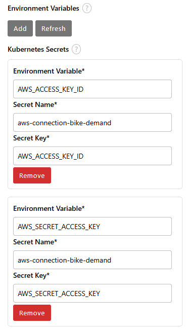
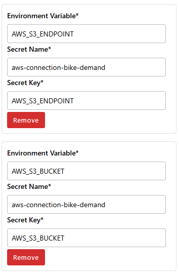

## 🔄 Automating the Workflow with Elyra Pipelines
After completing the manual execution of each notebook, the next step is to automate the workflow using Elyra's pipeline capabilities. Elyra allows you to visually compose, configure, and execute pipelines directly within JupyterLab, streamlining the machine learning lifecycle.

### 🛠️ Instructions:

#### 1. **Open Elyra Pipeline Editor:**
  - In JupyterLab, click on the Launcher tab.
  - Under the Elyra section, select Pipeline Editor to create a new pipeline.

#### 2. **Configure the Pipeline Environment:**
Before adding notebooks, ensure your Elyra environment is properly configured:

  - Connect to S3 Storage: Ensure you have access to an S3-compatible object store (e.g., AWS S3, MinIO).
  - Define Kubernetes Secrets: Use an existing Kubernetes secret that includes the following keys:
     - `AWS_ACCESS_KEY_ID`
     - `AWS_SECRET_ACCESS_KEY`
     - `AWS_S3_BUCKET`
     - `AWS_S3_ENDPOINT`
  
  - These secrets should be referenced in your runtime configuration to allow pipeline nodes to read/write from S3, as shown in these images:
  
    
    

  - Set a Default Runtime Configuration:
     - Go to Elyra’s Pipeline Settings.
     - Select or create a Runtime Configuration pointing to your Kubernetes-based execution environment (e.g., Kubeflow Pipelines, Apache Airflow, or local).
     - Assign this configuration as default to streamline pipeline runs.

#### 3. **Add Notebooks to the Pipeline:**
  - From the file browser, drag and drop the following notebooks onto the pipeline canvas:
     - `01_data_exploration.ipynb`
     - `02_model_training.ipynb`
     - `03_model_deployment.ipynb`
     - `04_drift_reports.ipynb`

#### 4. **Define Execution Order:**
    - Connect the notebooks in the order listed above by drawing lines between them, establishing the execution sequence.

#### 5. **Configure Node Properties:**
  - For each notebook node, specify the following:
    - Runtime Image: Select an appropriate Docker image that contains the necessary dependencies.
    - File Dependencies: List any files required by the notebook.
    - Output Files: Specify the files generated by the notebook that will be used in subsequent steps.
    - Environment Variables: Set any environment variables needed for execution.

#### 6. **Save the Pipeline:**
  - Click on File > Save Pipeline and name your pipeline, for example, `bike_demand_forecasting.pipeline`.

#### 7. **Run the Pipeline:**
   - Click on the Run Pipeline button (▶️) in the pipeline editor toolbar.
   - In the run configuration dialog:
    - Pipeline Name: Enter a name for this run instance.
    - Runtime Configuration: Choose the configuration you prepared in step 2.
 - Click Run to execute the pipeline.

#### 8. **Monitor Execution:**
   - Observe the execution progress in the Pipeline Editor and the JupyterLab console.
   - Upon completion, verify the outputs in the designated directories (e.g., data/processed/, models/, reports/), including any artifacts written to S3.

By automating the workflow with Elyra, you ensure consistency, reproducibility, and efficiency in your machine learning processes. This structured automation prepares the ground for continuous integration and deployment in real-world MLOps systems.