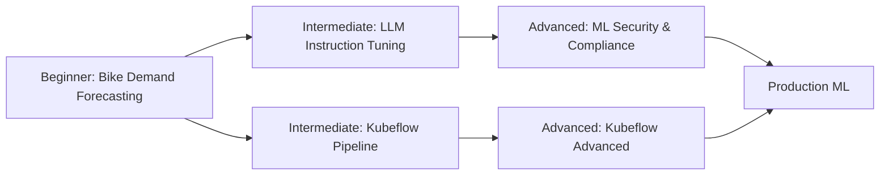

# Workshop Overview

In this page, we will go through implementing MLOps concepts to several use cases:

- **Beginner**: [Wine Quality Classifier](labs-docs/wine-quality-classifier.md), [Bike Demand Forecasting](labs-docs/bike-demand-forecasting.md)
- **Intermediate**: [LLM Instruction Tuning](labs-docs/02_intermediate/llm-instruction-tuning.md)

You will complete the following exercises, based on the difficulty of the workshop:

### Beginner Level

* [Wine Quality Classifier](labs-docs/wine-quality-classifier.md)
* [Bike Demand Forecasting](labs-docs/bike-demand-forecasting.md)

### Intermediate Level

* [LLM Instruction Tuning](labs-docs/02_intermediate/llm-instruction-tuning.md)

