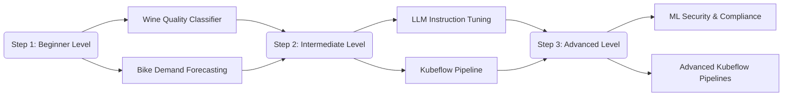

# Workshop Overview

In this page, we will go through implementing MLOps concepts to several use cases. 

The diagram below illustrates the stages of the MLOps lifecycle.

<figure markdown>
  { loading=lazy }
  <figcaption></figcaption>
</figure>

You will complete the following exercises, based on the difficulty of the workshop:

### Beginner Level

* [Wine Quality Classifier](labs-docs/01_beginner/wine-quality-classifier.md)
* [Bike Forecasting](labs-docs/01_beginner/bike-forecasting.md)

### Intermediate Level

* [LLM Instruction Tuning](labs-docs/02_intermediate/llm-instruction-tuning.md)
* [Bike Demand Forecasting Pipeline](labs-docs/02_intermediate/bike-demand-forecasting-pipeline.md)

### Advanced Level

* [ML Security & Compliance](labs-docs/03_advanced/ml-security-compliance.md)
* [Advanced Kubeflow Pipelines](labs-docs/03_advanced/kubeflow-advanced.md)

