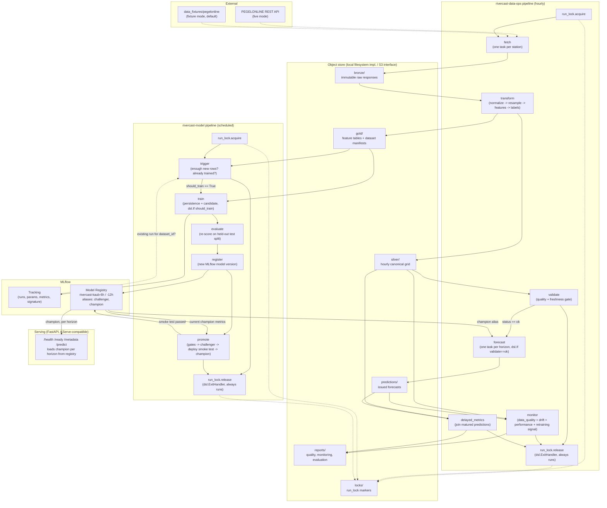

# RiverCast architecture (PLAN.md Phase 15)

This diagram reflects the implementation as it exists after Phase 14, not
the plan's original aspirational sketch — it is regenerated whenever the
pipeline DAGs, component set, or storage zones change materially (Phase 15
acceptance criterion: "the architecture diagram matches the
implementation"). Source of truth for each box: `docs/pipeline_components.md`
(components), `docs/adr/0002-data-versioning.md` (storage zones),
`pipelines/*.py` (DAG wiring).

## Component and data-flow diagram

## What each box is, and isn't, verified against

- Both pipelines compile to real KFP v2 YAML
  (`pipelines/compiled/rivercast-data-ops.yaml`,
  `pipelines/compiled/rivercast-model.yaml`) and are exercised end-to-end
  offline by `tests/integration/test_data_ops_pipeline.py` and
  `tests/integration/test_model_pipeline.py`. Real KFP `SubprocessRunner`
  execution on a live cluster and the OpenShift AI Pipelines UI are **not**
  verified in this environment (documented Windows/KFP incompatibility,
  Phase 8/9; re-verify in the Linux trainee workbench).
- The `run_lock` acquire/release boxes are new in Phase 15
  (`src/rivercast/concurrency.py`, `components/run_lock/`) — duplicate-run
  protection via an object-store-backed advisory lock, released through a
  KFP `ExitHandler` so a mid-pipeline failure still releases it.
- The object-store zones are exactly ADR 0002's six zones; `locks/` is a
  seventh, unzoned top-level prefix (not part of the bronze/silver/gold
  data-versioning contract, since lock markers are neither raw data nor a
  dataset).
- Serving is FastAPI today; the KServe `InferenceService`/`ServingRuntime`
  manifests under `deploy/` exist and validate (`kubectl kustomize`) but
  have not been applied to a live cluster from this environment (Phase 11
  gap, unchanged).
- `PEGEL`/`FIXT` are dashed because exactly one is active per `mode`
  (`fixture`/`live`) in config, never both.
